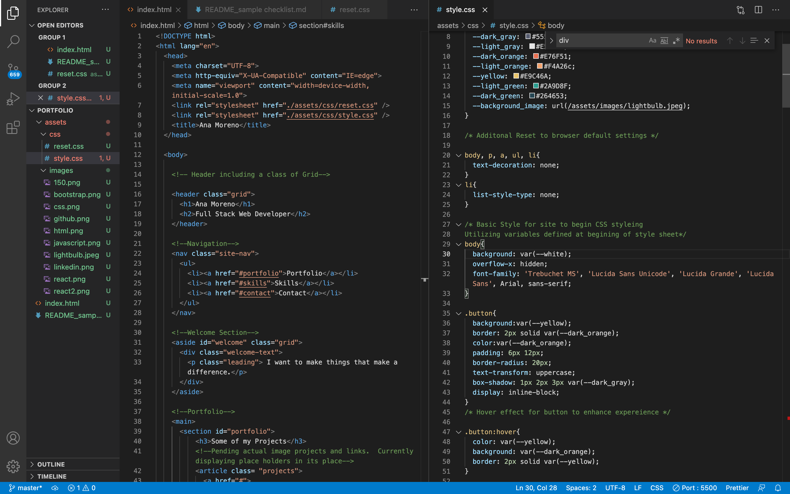

# Personal Portfolio for Ana Moreno

## Description

You will be viewing my personal portfolio. It is intended to provide you links and sampls of my work as well as my skills and to provide a manner in which to contact me. It is currently a work in progress with only placeholders for projects and links. The purpose of this portfolio is to allow me to present my skills and work avilities upon complestion of the bootcamp I am currently partiipating in. It will highlight skills already covered such as HTML and CSS alonw with skills soon to be learniend such as javascript and backend development. I look forward to continuing my and my portfolios progress.

## Installation

The following steps will be required to be performed to view the portfolio. No installation is required other than your browser of choice.

- Open browser of choice and navigat to https://al-moreno.github.io/Ana-Moreno-Portfolio/
- To view code on github navigate to https://github.com/al-moreno/Ana-Moreno-Portfolio

## Usage

You may find my current portfolio website helpful when attempting to find out what I have learned in HTML and CSS by reviewing my Code.

Alternativly you may open my code for review with VSCode.

https://github.com/al-moreno/portfolio/index.html

https://github.com/al-moreno/portfolio/assets/css/style.css

## Credits

The following individuals and / or sites collaborated and / or assisted with code:
meyerweb.com https://github.com/al-moreno/portfolio/assets/css/reset.css style sheet used to reset browser default.

Mighty minnow   https://www.mightyminnow.com/2013/11/what-is-mobile-first-css-and-why-does-it-rock/     Ulilized as a tutor guide for media quiries

## License

Uncertain of required licence so to CMA I am leaving the one pertaining to Trilogy Education Services.

---

© 2021 Trilogy Education Services, LLC, a 2U, Inc. brand. Confidential and Proprietary. All Rights Reserved.
